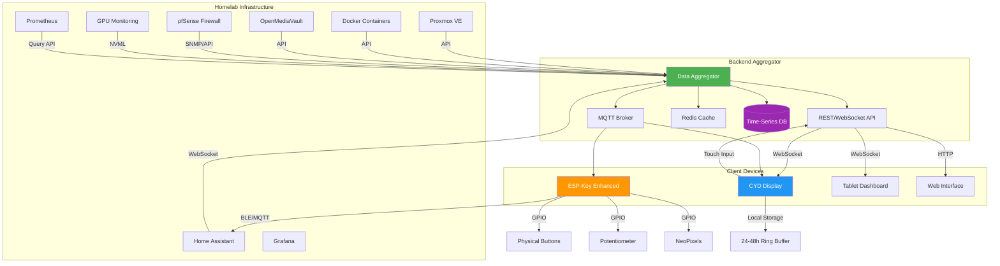

# 🏠 Homelab Dashboard Suite

Ein modulares, skalierbares Dashboard-System für dein Homelab mit CYD Display, ESP-Key Integration und Backend-Aggregation.

## 📊 System Architecture



## 🎯 Features

### Backend Aggregator
- **Multi-Source Data Collection**: Proxmox, Docker, OMV, pfSense, GPUs, Home Assistant
- **Real-time WebSocket API**: Low-latency data streaming
- **MQTT Integration**: IoT-friendly messaging
- **Ring Buffer Storage**: 24-48h lokale Historie auf Clients
- **Plugin System**: Erweiterbare Datenquellen
- **Error Handling**: Umfassendes Error-Code-System
- **Debug Mode**: Detaillierte Logs und Metriken

### CYD Dashboard
- **Modern UI**: Flüssige Animationen, keine Lags
- **Widget System**: Modular erweiterbare Komponenten
- **Touch Controls**: Interaktive Bedienung
- **Offline Mode**: Funktioniert ohne Netzwerkverbindung
- **Auto-Reconnect**: Robuste Verbindungswiederherstellung
- **Custom Themes**: Anpassbare Designs

### ESP-Key Enhanced
- **Potentiometer 2.0**: Smooth scrolling, multiple Modi
- **Button Combos**: Erweiterte Kombinationen
- **LED Feedback**: Visuelles Status-Feedback
- **MQTT Client**: Direkte Home Automation Steuerung
- **Macro Recording**: Live-Aufnahme von Aktionen
- **Profile System**: Mehrere Konfigurationsprofile

## 🚀 Quick Start

### Voraussetzungen
- Docker & Docker Compose
- Node.js 18+ (für lokale Entwicklung)
- PlatformIO (für ESP/CYD Firmware)
- Homelab-Zugänge (API Tokens, Credentials)

### Installation

#### 1. Backend starten
```bash
cd backend
docker-compose up -d
```

#### 2. Konfiguration anpassen
```bash
cp config/example.env config/.env
# Bearbeite config/.env mit deinen Zugangsdaten
```

#### 3. CYD Firmware flashen
```bash
cd cyd
pio run -t upload
```

#### 4. ESP-Key Firmware aktualisieren
```bash
cd ../esp-key-enhancements
pio run -t upload
```

## 📁 Projektstruktur

```
homelab-dashboard-suite/
├── backend/                 # Daten-Aggregator & API
│   ├── src/                # Quellcode
│   │   ├── aggregators/    # Datenquellen-Module
│   │   ├── api/            # REST & WebSocket
│   │   ├── mqtt/           # MQTT Handler
│   │   ├── storage/        # Datenbank & Cache
│   │   └── utils/          # Hilfsfunktionen
│   ├── config/             # Konfiguration
│   ├── tests/              # Tests
│   └── docker-compose.yml  # Docker Setup
│
├── cyd/                    # CYD Display Firmware
│   ├── src/                # Hauptcode
│   │   ├── ui/             # UI Komponenten
│   │   ├── widgets/        # Widget-Implementierungen
│   │   ├── comms/          # Kommunikation
│   │   └── storage/        # Lokaler Speicher
│   ├── lib/                # Externe Bibliotheken
│   └── assets/             # Grafiken & Fonts
│
├── esp-key-enhancements/   # ESP-Key Erweiterungen
│   ├── src/                # Erweiterter Code
│   ├── docs/               # Dokumentation
│   └── configs/            # Beispiel-Konfigurationen
│
└── docs/                   # Gesamtdokumentation
    ├── architecture/       # Architektur-Docs
    ├── api/                # API Dokumentation
    └── guides/             # Anleitungen
```

## 🔧 Konfiguration

### Backend (.env)
```bash
# Datenquellen
PROXMOX_URL=https://pve.local:8006
PROXMOX_TOKEN=your_token_here
DOCKER_HOST=localhost:2375
OMV_URL=http://omv.local
PFSENSE_URL=https://pfsense.local
HA_URL=http://homeassistant.local:8123
HA_TOKEN=your_ha_token

# API Settings
API_PORT=3000
WS_PORT=3001
MQTT_BROKER=mqtt://localhost:1883

# Storage
REDIS_URL=redis://localhost:6379
DB_PATH=/data/timeseries.db

# Debug
LOG_LEVEL=info
DEBUG_MODE=false
```

### CYD Config (config.json)
```json
{
  "wifi": {
    "ssid": "YourNetwork",
    "password": "YourPassword"
  },
  "backend": {
    "ws_url": "ws://backend.local:3001",
    "mqtt_broker": "mqtt://backend.local:1883"
  },
  "display": {
    "brightness": 80,
    "refresh_rate": 30,
    "theme": "dark"
  },
  "widgets": [
    {"type": "cpu", "position": [0, 0]},
    {"type": "memory", "position": [0, 100]},
    {"type": "network", "position": [0, 200]}
  ]
}
```

## 📖 Dokumentation

- [Architektur Details](docs/architecture/overview.md)
- [API Referenz](docs/api/rest.md)
- [Widget Entwicklung](docs/guides/widgets.md)
- [Fehlerbehandlung](docs/guides/error-handling.md)
- [Debugging Guide](docs/guides/debugging.md)

## 🤝 Contributing

1. Feature Branch erstellen
2. Änderungen implementieren
3. Tests schreiben
4. Pull Request öffnen

## 📄 License

MIT License

## 🙏 Credits

- LovyanGFX für CYD Grafik-Bibliothek
- NimBLE für BLE Kommunikation
- FastLED für LED Effekte
- Home Assistant Community
