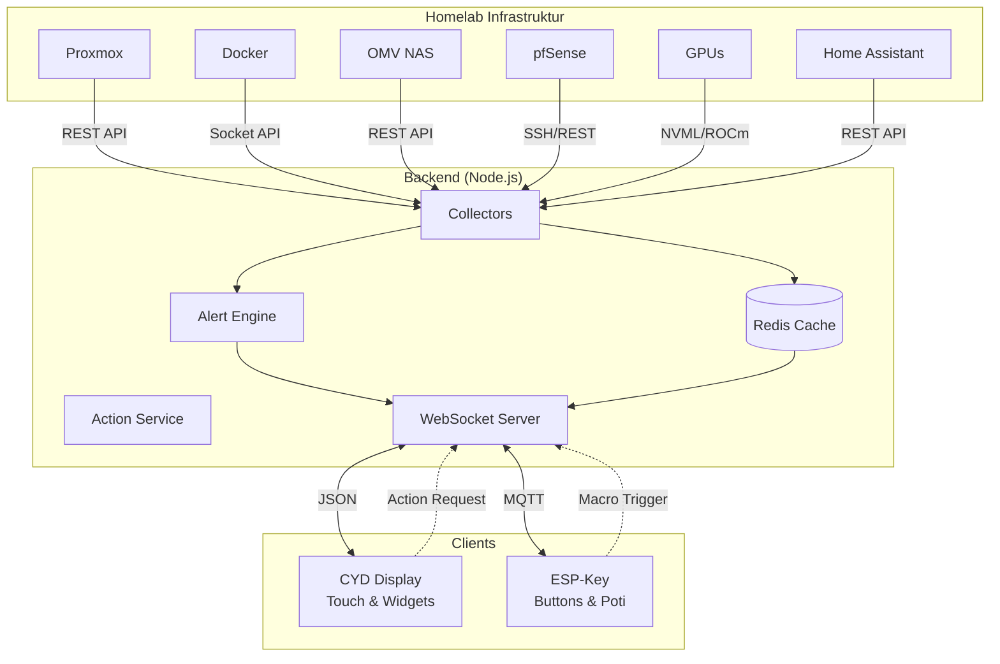

# 🚀 Homelab Dashboard Suite v2.0

> **Ein modulares, sicheres und skalierbares Echtzeit-Dashboard für deine Homelab-Infrastruktur.**  
> Überwache Proxmox, Docker, OMV, pfSense, GPUs und Home Assistant auf einem CYD-Touch-Display und steuere dein System mit dem ESP-Key-Macro-Pad.


---

## 📖 Inhaltsverzeichnis

- [Übersicht](#übersicht)
- [Features](#features)
- [Architektur](#architektur)
- [UI Vorschau](#ui-vorschau)
- [Schnellstart](#schnellstart)
- [Dokumentation](#dokumentation)
- [Projektstruktur](#projektstruktur)
- [Sicherheit](#sicherheit)
- [Roadmap](#roadmap)

---

## 🌟 Übersicht

Die **Homelab Dashboard Suite v2.0** ist die ultimative Lösung für alle, die ihre Server-Infrastruktur nicht nur im Browser überwachen, sondern **physisch erleben** wollen. 

Das System besteht aus drei Kernkomponenten:
1.  **Backend Aggregator**: Sammelt Daten aller Quellen, erkennt Alerts und führt Aktionen aus.
2.  **CYD Display**: Zeigt Metriken in schönen Widgets an, reagiert auf Touch-Gesten.
3.  **ESP-Key**: Physische Buttons und ein Potentiometer für Makros und Feinsteuerung.

**Warum dieses Projekt?**
- ✅ **Echtzeit**: < 200ms Latenz von der Quelle bis zum Display.
- ✅ **Autonom**: Funktioniert auch bei Netzausfall (lokaler 48h Ringbuffer).
- ✅ **Interaktiv**: Starte Container oder Dienste per Touch direkt vom Dashboard.
- ✅ **Sicher**: Rate Limiting, Auth-Tokens und Input-Validierung integriert.
- ✅ **Modular**: Erweitere es mit eigenen Widgets oder Datenquellen.

---

## ✨ Features

### Backend
- 🔄 **Multi-Source Aggregation**: Proxmox, Docker, OMV, pfSense, NVIDIA/AMD GPUs, Home Assistant.
- 🧠 **Smart Alert Engine**: Konfigurierbare Schwellwerte, Cooldowns, Severity-Levels.
- ⚡ **Action Service**: Sichere Ausführung von Docker-Befehlen, Scripten und HA-Services.
- 📊 **Health Score**: Berechnet einen Gesamtwert (0-100%) für dein System.
- 🔒 **Security Hardening**: JWT/Auth-Token, Rate Limiting, Logging mit Rotation.

### CYD Firmware (Display)
- 🎨 **Widget System**: Gauges, Charts, Status-Indikatoren, Info-Cards.
- 👆 **Touch Gestures**: Tap, Double-Tap, Long-Press (für Menüs), Swipe (für Historie).
- 🚨 **Alert Visualisierung**: Farbwechsel, Blinken, Overlays bei kritischen Zuständen.
- 💾 **Local History**: Speichert 24-48h Daten lokal auf dem ESP32.
- 📶 **Robust WiFi**: Auto-Reconnect mit exponentiellem Backoff + AP Fallback.

### ESP-Key Enhancements
- 🎛️ **Poti 2.0**: Glättung (EMA), Gestenerkennung, 4 Betriebsmodi.
- 💡 **LED Sync**: LEDs leuchten rot/gelb bei Alerts vom Backend.
- 🎹 **MQTT Integration**: Direkte Steuerung von Home Assistant Devices.
- ⌨️ **HID Macros**: Ducky Script Unterstützung für Tastenkombinationen.

---

## 🏗️ Architektur



### Datenfluss
1.  **Polling**: Backend fragt alle 5s (konfigurierbar) die Quellen ab.
2.  **Verarbeitung**: Daten werden normalisiert, auf Alerts geprüft und im Cache gespeichert.
3.  **Broadcast**: Updates werden per WebSocket an alle verbundenen Clients gesendet.
4.  **Visualisierung**: CYD rendert die Daten in Widgets (30 FPS).
5.  **Interaktion**: User tippt auf Widget -> Action Request an Backend -> Ausführung -> Feedback.

---

## 📱 UI Vorschau

### Dashboard Layout (Beispiel)
```
┌─────────────────────────────────────────────────────────────┐
│  🏠 Homelab Dashboard           🟢 System Health: 94%       │
├───────────────────┬───────────────────┬─────────────────────┤
│                   │                   │                     │
│   🖥️ PROXMOX CPU  │   🐳 DOCKER       │   🌡️ GPU TEMP       │
│   ╭───────────╮   │   ╭───────────╮   │   ╭───────────╮     │
│   │    ███    │   │   │  ██████   │   │   │    ██     │     │
│   │   █████   │   │   │  ██████   │   │   │   ███     │     │
│   │  ██████   │   │   │  ██████   │   │   │  ████     │     │
│   │ ███████   │   │   │  ██████   │   │   │ █████     │     │
│   ╰───────────╯   │   ╰───────────╯   │   ╰───────────╯     │
│      42%          │      12/15        │      65°C           │
│                   │                   │                     │
├───────────────────┴───────────────────┴─────────────────────┤
│  📈 NETWORK TRAFFIC (Last 24h)                              │
│  ╭───────────────────────────────────────────────────────╮  │
│  │    /\      /\                                         │  │
│  │   /  \    /  \   /\                                   │  │
│  │  /    \__/    \_/  \__                                │  │
│  │                                                         │  │
│  ╰───────────────────────────────────────────────────────╯  │
├───────────────────┬───────────────────┬─────────────────────┤
│   💾 OMV DISK     │   🔥 PFSENSE      │   💡 LIGHTS         │
│   78% used        │   WAN: 1Gbps      │   Wohnzimmer: ON    │
│   [████████░░]    │   LAN: 2.5Gbps    │   [Toggle Button]   │
└───────────────────┴───────────────────┴─────────────────────┘
```

### Alert Overlay (Critical)
```
┌─────────────────────────────────────────────────────────────┐
│                                                             │
│            ⚠️ CRITICAL ALERT ⚠️                             │
│                                                             │
│         Container 'nginx' exited unexpectedly               │
│                                                             │
│              [ Acknowledge ]  [ Restart ]                   │
│                                                             │
└─────────────────────────────────────────────────────────────┘
(Der Hintergrund blinkt rot)
```

### Action Menu (Long-Press auf Widget)
```
┌─────────────────────────────────┐
│  🐳 Docker: nginx               │
├─────────────────────────────────┤
│  ▶️  Start                      │
│  ⏹️  Stop                       │
│  🔄  Restart                    │
│  📜  View Logs                  │
│  ❌  Cancel                     │
└─────────────────────────────────┘
```

---

## 🚀 Schnellstart

### Voraussetzungen
- Docker & Docker Compose
- Node.js v18+ (nur für lokale Entwicklung)
- PlatformIO (für ESP32 Firmware)
- Ein CYD (ESP32-2432S028R) und optional ein ESP-Key

### 1. Backend installieren

```bash
cd backend
cp .env.example .env
nano .env  # Trage hier deine IPs und Tokens ein!

docker-compose up -d
```

Prüfe den Status:
```bash
docker-compose ps
curl http://localhost:3000/health
```

### 2. CYD Firmware flashen

```bash
cd cyd-firmware
pio run --target upload
pio device monitor --baud 115200
```

**Erster Start:**
- Das CYD öffnet einen WiFi Access Point (`Homelab-Setup`).
- Verbinde dich und gib deine WiFi-Daten ein (oder bearbeite `config.json` direkt).

### 3. ESP-Key flashen (Optional)

```bash
cd esp-key-enhancements
pio run --target upload
```

---

## 📚 Dokumentation

Für detaillierte Informationen siehe die offiziellen Dokumente:

| Dokument | Beschreibung | Link |
|----------|--------------|------|
| **PRD** | Product Requirement Document (Ziele, Features, Roadmap) | [Lesen](docs/PRD.md) |
| **SRS** | Software Requirements Specification (Detaillierte Anforderungen) | [Lesen](docs/SRS.md) |
| **Tech Spec** | Technical Specification (Architektur, Code, Protokolle) | [Lesen](docs/TECH_SPEC.md) |
| **Quickstart** | 5-Minuten Anleitung | [Lesen](QUICKSTART.md) |
| **Implementation Guide** | Schritt-für-Schritt für Entwickler | [Lesen](IMPLEMENTATION_GUIDE.md) |

---

## 📂 Projektstruktur

```
homelab-dashboard-suite/
├── backend/                 # Node.js Aggregator
│   ├── src/
│   │   ├── services/        # AlertEngine, ActionService
│   │   ├── aggregators/     # Proxmox, Docker, OMV...
│   │   ├── middleware/      # Auth, RateLimit, Logger
│   │   └── utils/           # ErrorCodes, Helpers
│   ├── config/              # Konfigurationen
│   ├── docker-compose.yml
│   └── .env.example
├── cyd-firmware/            # CYD Display Code
│   ├── src/
│   │   ├── main.cpp
│   │   └── services/        # Touch, WiFi, WebSocket
│   ├── include/
│   │   ├── core/            # Config, ErrorCodes
│   │   ├── widgets/         # Gauge, Chart, etc.
│   │   └── services/        # AlertManager, RingBuffer
│   └── platformio.ini
├── esp-key-enhancements/    # ESP-Key Erweiterungen
│   └── lib/
│       ├── MQTTHandler.h
│       └── PotentiometerAdvanced.h
├── docs/                    # Dokumentation
│   ├── PRD.md
│   ├── SRS.md
│   ├── TECH_SPEC.md
│   └── images/              # Screenshots & Diagramme
├── scripts/                 # Hilfs-Skripte
│   └── config-generator.py
├── README.md
├── QUICKSTART.md
└── IMPLEMENTATION_GUIDE.md
```

---

## 🔒 Sicherheit

Dieses Projekt wurde mit Security-by-Design entwickelt:

- **Authentifizierung**: Alle API-Endpunkte benötigen einen validen Token.
- **Rate Limiting**: Verhindert Brute-Force und DoS-Angriffe.
- **Input Validation**: Schutz vor Injection Attacks.
- **Secrets Management**: Keine Passwörter im Code (Nutze `.env`).
- **Netzwerk**: Betrieb in einem isolierten VLAN wird empfohlen.

⚠️ **Wichtig**: Ändere unbedingt die Standard-Tokens in der `.env` Datei bevor du das System produktiv nutzt!

---

## 🛣️ Roadmap

| Phase | Meilenstein | Status |
|-------|-------------|--------|
| M1 | Core Backend & Aggregators | ✅ Fertig |
| M2 | CYD Basis Firmware & Widgets | ✅ Fertig |
| M3 | Security Hardening & Alert Engine | ✅ Fertig |
| M4 | Interactive Actions & MQTT | ✅ Fertig |
| M5 | Telegram Bot & Voice Control | 🔄 In Arbeit |
| M6 | OTA Updates & Web Configurator | 📅 Geplant |
| M7 | AI Anomaly Detection | 💡 Idee |

---

## 🤝 Contributing

Beiträge sind willkommen! Bitte lese zuerst die [Contributing Guidelines](CONTRIBUTING.md).

1.  Forke das Repo
2.  Erstelle einen Feature Branch (`git checkout -b feature/amazing-feature`)
3.  Committe deine Änderungen (`git commit -m 'Add amazing feature'`)
4.  Pushe den Branch (`git push origin feature/amazing-feature`)
5.  Öffne einen Pull Request

---

## 📄 Lizenz

Dieses Projekt ist unter der MIT-Lizenz lizenziert. Siehe [LICENSE](LICENSE) für Details.

---

## 🙏 Danksagungen

- [LovyanGFX](https://github.com/lovyan03/LovyanGFX) für die fantastische Grafik-Bibliothek.
- [PlatformIO](https://platformio.org/) für das tolle Ökosystem.
- Der gesamten ESP32-Community für Inspiration und Support.

---

**Viel Spaß beim Bauen und Überwachen!** 🛠️📊

*Erstellt mit ❤️ für die Homelab-Community*
